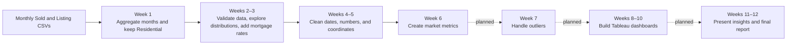

# IDX Exchange — Data Analyst Internship

An end-to-end California residential real-estate analytics project built from
monthly CRMLS listing and sold records. The workflow turns confidential MLS
exports into validated, analysis-ready market metrics and aggregate visuals for
future Tableau reporting.

The public repository contains code, documentation, and aggregate charts only.
Raw and generated MLS CSV files are confidential working data and are excluded
from Git.

## Project at a glance

The analysis currently covers **January 2024 through June 2026**. It begins with
monthly Listing and Sold CSV files, narrows the data to residential properties,
checks quality, enriches records with mortgage rates, removes invalid values,
and creates metrics that describe price, market speed, and transaction timing.

Current completed scope: **Weeks 1–6**. Weeks 7–12 below are the planned next
stages of the internship roadmap.



## MLS, CRMLS, and IDX

- **MLS (Multiple Listing Service)** is a shared database used by real-estate
  professionals to publish and exchange property listing and transaction data.
- **CRMLS (California Regional Multiple Listing Service)** is the MLS source for
  this project. Its records primarily cover California markets. See the
  [CRMLS overview](https://go.crmls.org/about/) and
  [coverage area](https://go.crmls.org/coverage-area/).
- **IDX (Internet Data Exchange)** is the framework that allows approved MLS
  listing information to appear on brokerage and real-estate websites. See the
  [CRMLS IDX resources](https://go.crmls.org/idx-resources/).

### Why “California Residential”?

“California” describes the **geographic market** represented by the CRMLS
source. “Residential” is a **property-type filter** applied in Week 1. The raw
files can include other property types, so this project keeps rows where
`PropertyType == "Residential"` to create a more consistent housing-market
analysis. Later validation also flags records with impossible or
out-of-California coordinates.

## What the two datasets represent

| Dataset | Meaning | Main analytical use |
| --- | --- | --- |
| **Listing** | Properties offered on the market, including active, pending, withdrawn, expired, and other listing outcomes | Measure inventory, asking prices, days on market, and listing status |
| **Sold** | Properties with a completed sale and recorded closing information | Measure transaction prices, sale timing, price ratios, and price per square foot |

Important field groups include property and listing identifiers, original/list
and close prices, listing/contract/close dates, property characteristics such as
living area and bedrooms, and geographic fields such as county, city, latitude,
and longitude. Row-level values are never published in this repository.

## Business questions

The project is designed to help answer:

- How do California residential prices change over time?
- How do prices differ across counties?
- How long does a property usually take to find a buyer?
- After an offer is accepted, how long does closing usually take?
- Do homes tend to sell above or below their original asking price?
- What is the typical sale price per square foot?
- Do housing-market patterns change when mortgage rates rise or fall?
- Which records contain input errors, impossible values, or extreme outliers?
- Which cleaned records are reliable enough for Tableau dashboards and reporting?

## Repository structure

| Week | Folder | Main work |
| --- | --- | --- |
| Week 1 | [`week1/`](week1/) | Monthly aggregation and Residential filtering |
| Weeks 2–3 | [`week2-3/`](week2-3/) | EDA, validation, distributions, and FRED mortgage rates |
| Weeks 4–5 | [`week4-5/`](week4-5/) | Data cleaning and quality flags |
| Week 6 | [`week6/`](week6/) | Market metrics and segmented summaries |

Each folder contains its own Python script(s), README, key results, and selected
aggregate charts where a visual is useful.

## Requirements

- Python 3.11 or newer
- pandas
- matplotlib
- Internet access during the FRED mortgage-rate step

```bash
python3 -m pip install -r requirements.txt
```

## Input files

Place monthly source files in the repository root:

```text
CRMLSListingYYYYMM.csv
CRMLSSoldYYYYMM.csv
```

When both versions exist for a Sold month, Week 1 selects the `_filled` version
instead of the raw version. Only one file is used per dataset and month.

## Run the pipeline

Run from the repository root:

```bash
python3 week1/aggregation.py
python3 week2-3/dataset_validation.py
python3 week2-3/mortgage_rate_enrichment.py
python3 week4-5/data_cleaning.py
python3 week6/feature_engineering.py
```

The current local analysis covers January 2024 through June 2026. Week 1
discovers the latest month automatically and verifies continuous monthly
coverage from January 2024.

## Data safety

The `.gitignore` blocks CSV files, generated outputs, local backups, notebooks,
GeoJSON, and the internship handbook. README charts contain aggregate results
only—never addresses, listing identifiers, coordinates, or row-level MLS data.

Before publishing, this command should return no output:

```bash
git ls-files '*.csv' '*.CSV' '*.geojson' '*.ipynb'
```

School-district spatial mapping is intentionally excluded because it belongs to
the separate AI Agent project.
