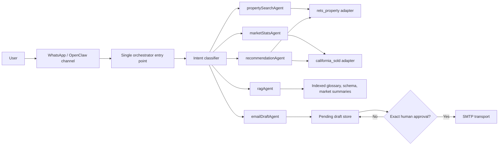

# Weeks 8-11 Architecture

## Boundary design

- `openclaw_entrypoint.py` is the single channel-facing entry point.
- `Orchestrator` owns intent classification and session-level last results.
- Specialized agents return the shared `AgentResult` model.
- `GroundedRAG` returns source names with every supported answer.
- `WhatsAppMessageHandler` formats at most five listing cards and suppresses internal exceptions.
- `EmailWorkflow` separates drafting from sending. SMTP is unreachable until an exact approval token is supplied.

The included listing records and email transport are fictional test doubles. Production adapters must replace them with parameterized MySQL queries, the linked OpenClaw WhatsApp channel, and an approved SMTP account.
