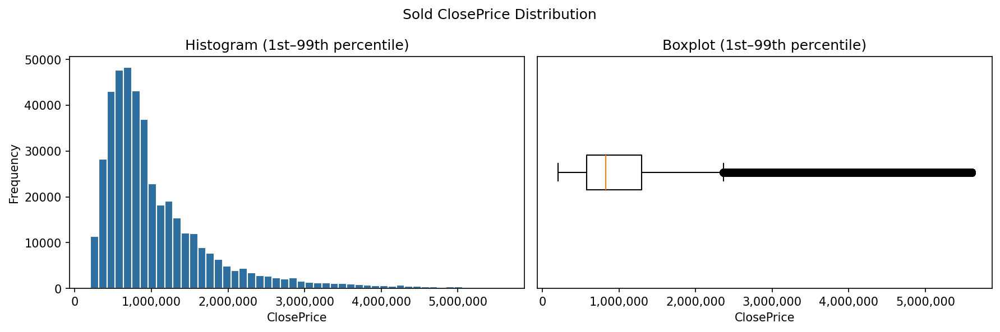
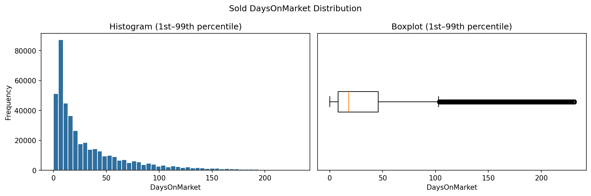
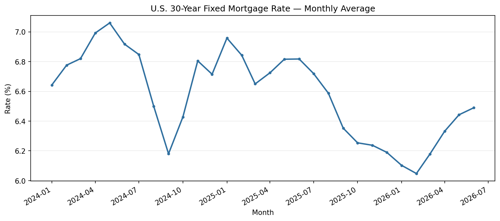

# Weeks 2–3 — Validation, EDA, and Mortgage Rates

## Objective

Understand the Residential datasets, document missingness and distributions,
identify potential outliers, and merge monthly U.S. 30-year fixed mortgage
rates from FRED.

## Scripts

- [`dataset_validation.py`](dataset_validation.py): missing-value reports,
  percentile summaries, IQR outlier counts, histograms, and boxplots.
- [`mortgage_rate_enrichment.py`](mortgage_rate_enrichment.py): downloads FRED
  `MORTGAGE30US`, calculates monthly averages, merges rates, and validates the
  result.

## Latest verified results

| Check | Sold | Listings |
| --- | ---: | ---: |
| Input rows | 435,792 | 547,930 |
| Columns above 90% missing | 15 | 13 |
| Median price | $825,000 ClosePrice | $845,000 ListPrice |
| Median living area | 1,645 sq ft | 1,670 sq ft |
| Median days on market | 18 | 10 |
| Rows without mortgage rate | 0 | 0 |

One Listing row with an invalid or missing `ListingContractDate` was excluded
before the mortgage merge. No valid dated rows were missing a monthly rate.

## Distribution charts

The charts use the 1st–99th percentile display range so extreme values do not
compress the main distribution. Numeric summaries and outlier reports still
use the complete dataset.





## Mortgage-rate trend



For the MLS period, monthly averages ranged from **6.0475% to 7.06%**.

## Run

```bash
python3 week2-3/dataset_validation.py
python3 week2-3/mortgage_rate_enrichment.py
```

Detailed local outputs are written to `outputs/week2/` and `outputs/week2_3/`.
