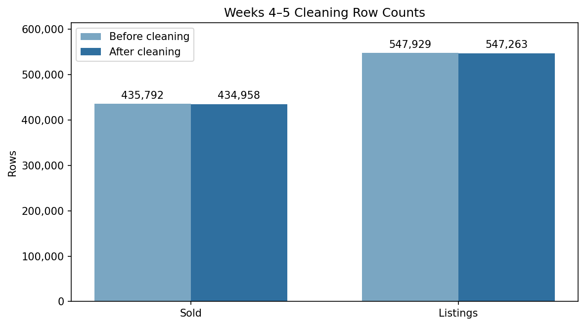

# Weeks 4–5 — Data Cleaning and Preparation

## Objective

Convert required fields to reliable data types, flag invalid values, validate
transaction timelines and coordinates, and produce analysis-ready datasets.

## Script

[`data_cleaning.py`](data_cleaning.py)

The workflow:

- converts date and numeric columns with invalid values coerced to missing;
- flags invalid prices, living areas, days on market, bedrooms, and bathrooms;
- checks listing, purchase-contract, and close-date ordering;
- flags missing, zero, positive-longitude, implausible, and out-of-state
  coordinates;
- removes rows that fail the documented cleaning rules;
- validates that invalid rows do not remain in the cleaned output.

## Latest verified results

| Dataset | Rows before | Rows removed | Rows after | Removed |
| --- | ---: | ---: | ---: | ---: |
| Sold | 435,792 | 834 | 434,958 | 0.1914% |
| Listings | 547,929 | 666 | 547,263 | 0.1215% |

### Sold date consistency flags

| Flag | Rows |
| --- | ---: |
| Listing date after close | 67 |
| Purchase-contract date after close | 239 |
| Negative listing-to-contract timeline | 290 |



## Run

```bash
python3 week4-5/data_cleaning.py
```

Detailed local outputs are written to `outputs/week4_5/`.
