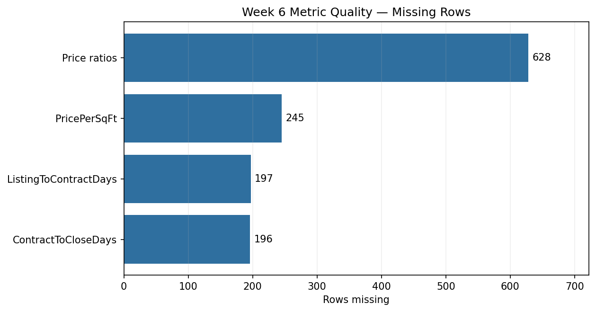

# Week 6 — Feature Engineering and Market Metrics

## Objective

Create analysis metrics used by later market summaries and Tableau dashboards.

## Script

[`feature_engineering.py`](feature_engineering.py)

The script creates:

- `PriceRatio` and `CloseToOriginalListRatio`;
- `PricePerSqFt`;
- `Year`, `Month`, and `YrMo` from `CloseDate`;
- `ListingToContractDays`;
- `ContractToCloseDays`;
- eligibility flags for each calculated metric;
- county-level transaction and market summaries.

School-district spatial mapping is excluded because it belongs to the separate
AI Agent project.

## Latest verified results

Rows processed: **434,958**

| Metric | Rows populated | Rows missing | Coverage |
| --- | ---: | ---: | ---: |
| Price ratios | 434,330 | 628 | 99.86% |
| Price per sq ft | 434,713 | 245 | 99.94% |
| Listing to contract days | 434,761 | 197 | 99.95% |
| Contract to close days | 434,762 | 196 | 99.95% |



Potential extreme metric values are retained for Week 7 outlier handling rather
than silently removed during feature engineering.

## Run

```bash
python3 week6/feature_engineering.py
```

Detailed local outputs are written to `outputs/week6/`.
