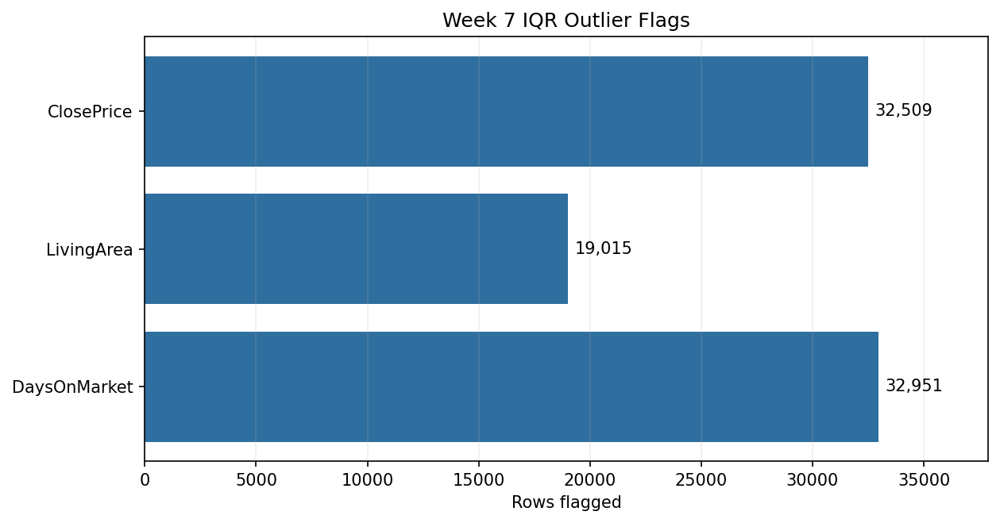

# Week 7 — Outlier Detection and Data Quality

## Objective

Use the 1.5 × interquartile range (IQR) method to identify extreme values
without deleting records from the full dataset. A separate filtered dataset is
created for analysis and Tableau.

## Script

[`outlier_detection.py`](outlier_detection.py)

The script:

- calculates dataset-wide IQR bounds for `ClosePrice`, `LivingArea`, and
  `DaysOnMarket`;
- adds a separate outlier flag for each field and an `any_outlier_flag`;
- adds business-rule flags for non-positive prices or living areas and negative
  days on market;
- keeps a complete flagged dataset for auditability;
- creates a filtered dataset that excludes statistical outliers and
  business-rule-invalid records;
- writes IQR and before/after comparison summaries.

Missing values are retained and are not classified as outliers. Week 6
eligibility flags remain available for analyses that require non-null metrics.

## Latest verified results

Input rows: **434,958**

| Field | Q1 | Q3 | IQR lower bound | IQR upper bound | Rows flagged |
| --- | ---: | ---: | ---: | ---: | ---: |
| ClosePrice | 575,000 | 1,300,000 | -512,500 | 2,387,500 | 32,509 |
| LivingArea | 1,248 | 2,222 | -213 | 3,683 | 19,015 |
| DaysOnMarket | 8 | 48 | -52 | 108 | 32,951 |

The negative statistical lower bounds are preserved exactly as calculated.
Separate business rules handle impossible non-positive price and area values or
negative days on market.



### Before and after filtering

| Dataset | Rows | Median ClosePrice | Median LivingArea | Median DaysOnMarket |
| --- | ---: | ---: | ---: | ---: |
| Full flagged | 434,958 | $825,000 | 1,645 | 18 |
| Clean filtered | 366,890 | $788,000 | 1,570 | 16 |

Across the three fields, **68,068 rows (15.65%)** have at least one IQR
outlier flag. No additional non-null rows failed the business rules in the
latest Week 6 input.

## Outputs

Detailed local outputs are written to `outputs/week7/`:

- `sold_week7_flagged.csv` — every Week 6 row plus quality flags;
- `sold_week7_filtered.csv` — rows where `analysis_exclude_flag` is false;
- `outlier_summary.csv` — IQR bounds, missing counts, and outlier counts;
- `dataset_comparison.csv` — row counts and medians before and after filtering.

CSV outputs remain local because MLS records are confidential and excluded by
the repository `.gitignore`.

## Run

```bash
python3 week7/outlier_detection.py
```
