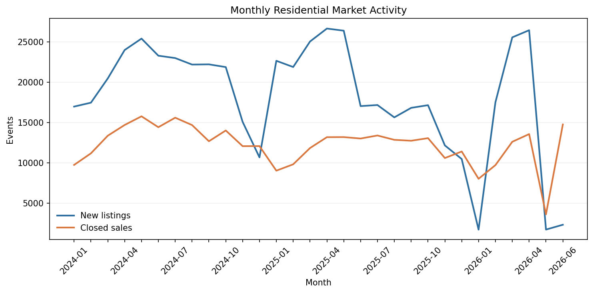

# Week 8 — Tableau Data Preparation and Market Dashboard Setup

## Objective

Prepare compact, validated Tableau data sources from the clean Week 7 sold
records and the clean Weeks 4–5 listing records. Week 8 establishes the Market
Analysis workbook foundation; the final two Tableau workbooks are due at the
end of the combined Weeks 8–10 phase.

## Script

[`tableau_data_prep.py`](tableau_data_prep.py)

The script creates:

- a long-format market event table that supports new listings, closed sales,
  median close price, average days on market, and average close-to-original-list
  ratio;
- a competitive sales table with agent, office, sales volume, unit, and
  geographic fields for Weeks 9–10;
- monthly validation summaries and local top-100 agent and office checks;
- an audit summary reconciling input rows, output events, exact duplicates, and
  calendar coverage.

The close-to-original-list ratio receives a metric-specific IQR eligibility
check before Tableau aggregation. Ratio outliers are converted to null only for
that measure; their sale rows remain available for closed-sales counts and all
other eligible metrics.

## Latest verified results

Coverage: **January 2024 through June 2026 (30 months)**

| Dataset / check | Rows |
| --- | ---: |
| Week 7 clean sold input | 366,890 |
| Exact duplicate sold events removed | 34 |
| Closed-sale events | 366,856 |
| New-listing events | 547,263 |
| Combined market events | 914,119 |
| Competitive sales rows | 366,856 |

The market and competitive outputs contain zero duplicate `EventId` values.
The five required market measures reconcile to 547,263 new listings and
366,856 closed sales.

For `CloseToOriginalListRatio`, the Week 8 IQR eligibility range is
**0.8758–1.1111**. The script retains all sale rows but excludes 34,302 ratio
outliers from that measure's averages; 332,131 ratios remain eligible. Monthly
eligible-ratio averages range from 98.38% to 100.96%, replacing the distorted
results produced by the raw extreme ratios.



### Source completeness caution

The monthly validation step flags months with event counts below 50% of the
30-month median. The latest source files contain unusually low new-listing
volume for January, May, and June 2026, and unusually low closed-sales volume
for May 2026. These months are retained without imputation; Tableau viewers
should treat them as potentially incomplete source periods rather than market
collapses.

## Local outputs

- `tableau_market_events.csv` — Market Analysis Tableau source;
- `tableau_competitive_sales.csv` — Competitive Analysis Tableau source;
- `market_monthly_summary.csv` — validation of all five market measures;
- `top_100_listing_agents.csv` and `top_100_listing_offices.csv` — local
  ranking checks;
- `tableau_data_quality_summary.csv` — row, duplicate, metric, and coverage
  audit.

## Tableau Public setup

1. Open Tableau Public and connect to
   `outputs/week8/tableau_market_events.csv` as a Text File.
2. Assign geographic roles to `City`, `CountyOrParish`, and `PostalCode`.
3. Add `City`, `CountyOrParish`, `PostalCode`, and `PropertySubType` as filters,
   then apply them to all worksheets using this data source.
4. Build the following worksheets with continuous MONTH(`EventDate`) on
   Columns:

| Worksheet | Rows / Marks | Required filter |
| --- | --- | --- |
| Monthly Median Close Price | MEDIAN(`ClosePrice`) | EventType = Closed Sale |
| Average Days on Market | AVG(`DaysOnMarket`) | EventType = Closed Sale |
| Average Close-to-Original-List Ratio | AVG(`CloseToOriginalListRatio`) | EventType = Closed Sale |
| New Listings | SUM(`NewListings`) | None |
| Closed Sales | SUM(`ClosedSales`) | None |

5. Place the five worksheets in one Market Overview dashboard and show the four
   shared filters.
6. Save the workbook as `market_analysis.twbx`.

See [`DATA_DICTIONARY.md`](DATA_DICTIONARY.md) for field roles and formatting.

## Data safety

The Tableau CSV files contain confidential row-level MLS information and remain
local under `outputs/week8/`, which is excluded from Git. Only code,
documentation, and aggregate validation charts are published.

## Run

```bash
python3 week8/tableau_data_prep.py
```
